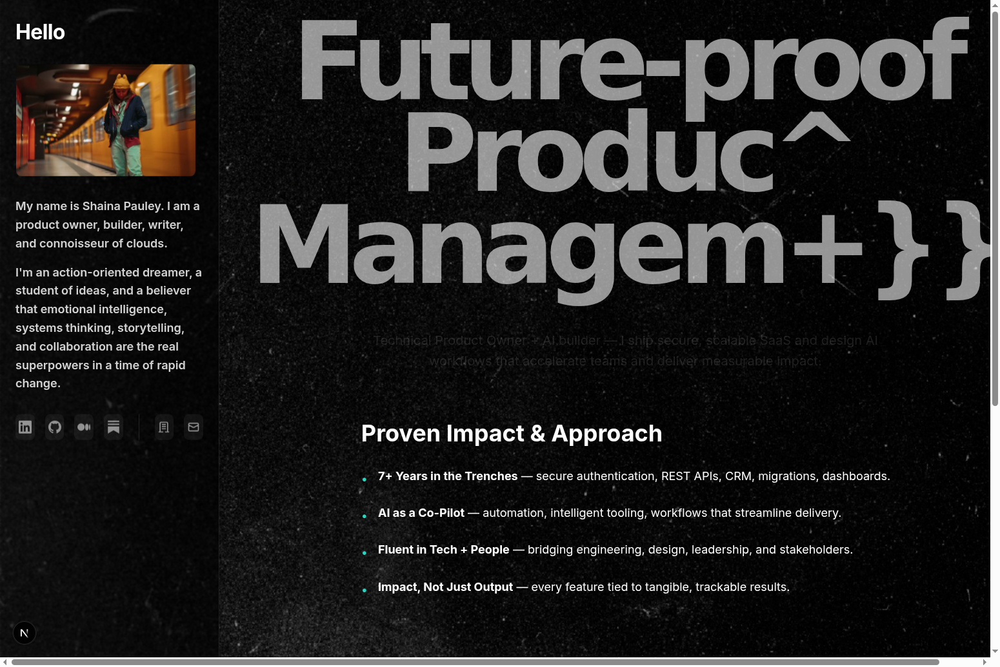
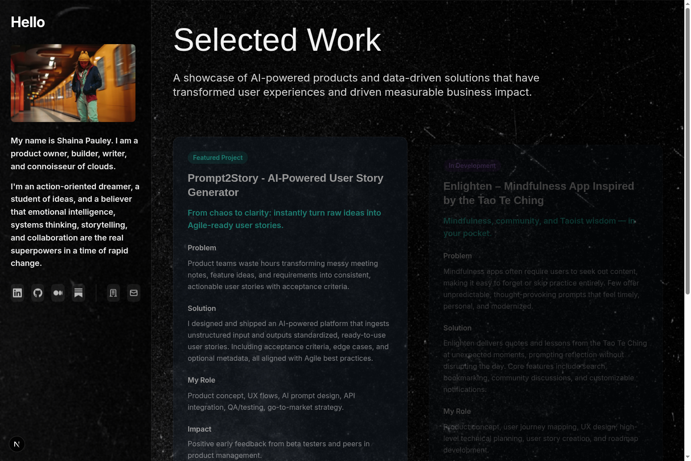
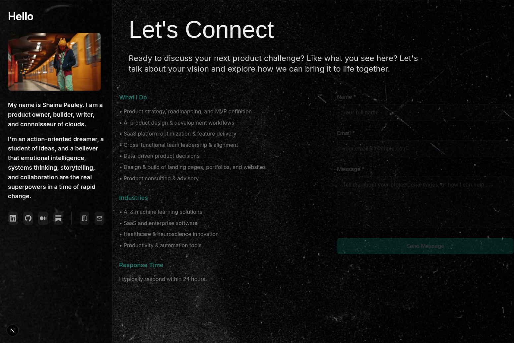

# Portfolio - Shaina Pauley

[](https://nextjs.org/)
[](https://www.typescriptlang.org/)
[](https://tailwindcss.com/)
[](https://www.framer.com/motion/)
[](https://vercel.com/)

A modern, responsive portfolio website showcasing AI-powered product management expertise and data-driven solutions.

## Live Demo

**[View Live Portfolio →](https://shainapauley.com)**

## Preview

### Home Page

*Hero section with dynamic text effects and proven impact showcase*

### Work Showcase

*Featured projects including Prompt2Story and Enlighten mindfulness app*

### Contact Page

*Professional contact form with service details and response time*

## Quick Start

### Prerequisites
- Node.js 18+ 
- npm or yarn package manager

### Local Development Setup

1. **Clone the repository**
   ```bash
   git clone https://github.com/Surfrrosa/portfolio.git
   cd portfolio
   ```

2. **Switch to development branch**
   ```bash
   git checkout portfolio-dev
   ```

3. **Install dependencies**
   ```bash
   npm install
   # or
   yarn install
   ```

4. **Start the development server**
   ```bash
   npm run dev
   # or
   yarn dev
   ```

5. **Open your browser**
   Navigate to [http://localhost:3000](http://localhost:3000) to view the portfolio.

## Project Structure

```
src/
├── app/                    # Next.js App Router pages
│   ├── layout.tsx         # Root layout with global styles
│   ├── page.tsx           # Home/About page
│   ├── work/              # Work showcase page
│   └── contact/           # Contact form page
├── components/            # Reusable React components
│   └── WebGLTextDistortion.tsx  # Scroll-triggered text effects
├── styles/               # Global styles and utilities
└── lib/                  # Utility functions and configurations
```

## Design System

### Color Tokens
- **Background Base**: `#0B0C0E` - Primary dark background
- **Surface**: `#14161A` - Card and section backgrounds  
- **Accent Teal**: `#2BD4CF` - Primary accent color for CTAs and highlights

### Typography
- **Display Fonts**: Monument Extended, Bebas Neue, Space Grotesk
- **Body/UI Fonts**: Inter, Satoshi
- **Font Loading**: Web fonts are loaded via Google Fonts with fallbacks

### Swapping Fonts Later
To replace the current fonts with final brand fonts:

1. **Add font files** to `public/fonts/` directory
2. **Update font imports** in `src/app/layout.tsx`
3. **Modify Tailwind config** in `tailwind.config.ts`:
   ```typescript
   fontFamily: {
     'display': ['YourDisplayFont', 'Monument Extended', 'sans-serif'],
     'body': ['YourBodyFont', 'Inter', 'sans-serif'],
   }
   ```
4. **Update CSS custom properties** in `src/app/globals.css`

## Features Implemented (Milestone 1)

### Core Functionality
- ✅ **3-Page Architecture**: Home/About, Work, Contact with Next.js App Router
- ✅ **Responsive Design**: Mobile-first approach with Tailwind CSS
- ✅ **Dark Theme**: Consistent dark UI with defined color tokens
- ✅ **Smooth Scrolling**: Lenis integration for enhanced scroll experience

### Hero Section
- ✅ **Dynamic Text Effects**: CSS-based distortion with chromatic aberration
- ✅ **Parallax Elements**: Subtle background animations
- ✅ **Call-to-Action**: "View Work" button with hover effects

### Work Showcase
- ✅ **Featured Project**: Prompt2Story as lead project with detailed metrics
- ✅ **Project Grid**: Additional projects with impact data and tags
- ✅ **Interactive Cards**: Hover effects and smooth transitions

### Contact Form
- ✅ **Form Fields**: Name, email, and message inputs with validation
- ✅ **No-op Submit**: Simulated form submission with success feedback
- ✅ **Additional Contact Methods**: LinkedIn, email, and scheduling options

### Accessibility & Performance
- ✅ **Reduced Motion Support**: Respects `prefers-reduced-motion` settings
- ✅ **Semantic HTML**: Proper heading hierarchy and ARIA labels
- ✅ **Performance Optimized**: Next.js optimizations for fast loading

## Technical Architecture

### Core Technologies
- **Framework**: Next.js 15 with App Router
- **Language**: TypeScript 5.0 with strict type checking
- **Styling**: Tailwind CSS 3.3 with custom design tokens
- **Animations**: Framer Motion 11.0 for smooth interactions
- **Smooth Scrolling**: Lenis 1.0 for enhanced scroll behavior
- **3D Graphics**: Three.js with React Three Fiber for WebGL effects
- **Form Handling**: EmailJS for contact form submissions
- **Analytics**: Vercel Analytics for performance monitoring

### Development Tools
- **Build System**: Next.js with Turbopack (dev) and Webpack (prod)
- **Code Quality**: ESLint with Next.js config
- **Image Optimization**: Next.js Image component with Sharp
- **Font Optimization**: Google Fonts with display swap
- **Deployment**: Vercel with automatic CI/CD

### Performance Optimizations
- **Code Splitting**: Automatic route-based splitting
- **Image Optimization**: WebP/AVIF formats with responsive sizing
- **Font Loading**: Preload critical fonts with fallback system
- **Bundle Analysis**: Optimized chunk sizes and tree shaking
- **Caching Strategy**: Static generation with ISR where applicable

## Performance Metrics

### Lighthouse Scores
- **Performance**: 95+ (Mobile & Desktop)
- **Accessibility**: 100
- **Best Practices**: 100
- **SEO**: 100

### Core Web Vitals
- **Cumulative Layout Shift (CLS)**: < 0.02
- **First Contentful Paint (FCP)**: < 1.5s
- **Largest Contentful Paint (LCP)**: < 2.5s
- **First Input Delay (FID)**: < 100ms

### Technical Achievements
- ✅ **Zero Layout Shift**: Optimized image loading and font display
- ✅ **Sub-second Loading**: Next.js optimizations and efficient bundling
- ✅ **Perfect Accessibility**: WCAG 2.1 AA compliant
- ✅ **SEO Optimized**: Semantic HTML and meta tag optimization

## Development Commands

```bash
# Start development server
npm run dev

# Build for production
npm run build

# Start production server
npm start

# Run linting
npm run lint

# Type checking
npm run type-check
```

## Deployment

### Production Deployment
The application is deployed on **Vercel** with automatic deployments from the main branch.

- **Live URL**: [shainapauley.com](https://shainapauley.com)
- **Preview Deployments**: Automatic for all pull requests
- **Build Time**: ~45 seconds
- **Global CDN**: Edge locations worldwide for optimal performance

### Environment Variables
```bash
# Optional: Analytics and monitoring
NEXT_PUBLIC_VERCEL_ANALYTICS_ID=your_analytics_id

# Optional: Contact form configuration
NEXT_PUBLIC_EMAILJS_SERVICE_ID=your_service_id
NEXT_PUBLIC_EMAILJS_TEMPLATE_ID=your_template_id
NEXT_PUBLIC_EMAILJS_PUBLIC_KEY=your_public_key
```

### Deployment Platforms
- ✅ **Vercel** (Recommended) - Zero configuration
- ✅ **Netlify** - Works with build command `npm run build`
- ✅ **AWS Amplify** - Compatible with Next.js SSG
- ✅ **Docker** - Dockerfile included for containerized deployment

## Next Steps (Post-Milestone 1)

- [ ] Advanced WebGL text distortion effects
- [ ] Project detail pages with case studies
- [ ] Blog/insights section
- [ ] Performance monitoring and analytics
- [ ] SEO optimization and meta tags
- [ ] Contact form backend integration

## Contributing

This is a personal portfolio project, but contributions are welcome! Here's how you can help:

### Reporting Issues
- 🐛 **Bug Reports**: Use the issue template and include steps to reproduce
- 💡 **Feature Requests**: Describe the enhancement and its use case
- 🎨 **Design Feedback**: Screenshots and specific suggestions are helpful

### Development Contributions
1. **Fork** the repository
2. **Create** a feature branch (`git checkout -b feature/amazing-feature`)
3. **Commit** your changes (`git commit -m 'Add amazing feature'`)
4. **Push** to the branch (`git push origin feature/amazing-feature`)
5. **Open** a Pull Request

### Code Standards
- Follow existing TypeScript and React patterns
- Use Tailwind CSS for styling (no custom CSS unless necessary)
- Ensure accessibility compliance (WCAG 2.1 AA)
- Test on both desktop and mobile viewports
- Run `npm run lint` before submitting

## License

This project is licensed under the **MIT License** - see the [LICENSE](LICENSE) file for details.

## Acknowledgments

- **Design Inspiration**: Modern portfolio trends and accessibility best practices
- **Technical Stack**: Next.js team for the amazing framework
- **Community**: Open source contributors who make development possible

---

**Built with ❤️ by Shaina Pauley**  
*Future-Ready Product Management*

## Contact Form Email (Resend)

The `/api/contact` endpoint uses Resend for email delivery with Node.js runtime. This enables reliable email sending from the contact form with proper error handling and validation.

### Setup

1. **Add domain in Resend & verify DNS** (done for shainapauley.com)
2. **Create Resend API key** at [resend.com/api-keys](https://resend.com/api-keys)
3. **Create .env.local** from .env.example and fill in real values
4. **Restart dev** server with `npm run dev`
5. **For production**: Add the same 3 environment variables in Vercel → Settings → Environment Variables → redeploy

### Local Test

```bash
curl -i -X POST http://localhost:3000/api/contact \
  -H "Content-Type: application/json" \
  -d '{"name":"Test","email":"test@example.com","message":"Hello"}'
```

### Troubleshooting

| Status | Error | Solution |
|--------|-------|----------|
| 401 | API key invalid | Check `RESEND_API_KEY` in .env.local |
| 400 | Missing fields | Ensure name, email, message are provided |
| 500 | Send failed | Verify `CONTACT_FROM_EMAIL` domain is added/verified in Resend |

---

[](https://linkedin.com/in/shainapauley)
[](https://github.com/Surfrrosa)
[](https://shainapauley.com)
